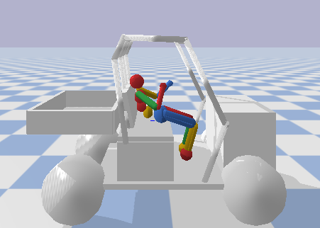

# drunk-drivers
Reinforcement learning to teach a humanoid robot to step out of a car in simulation

Install pybullet_robots, gym ... just solve all import errors :)

Clone repository
```
cd $path$
git clone https://github.com/peconver/drunk-drivers.git
```

Run simulation
```
cd drunk-drivers
python3 play.py
```
To reset simulation press 'i'


Upload changes made on $your_file$
```
cd drunk-drivers
git add $your_file$
git commit
git push
```

Download changes
```
cd drunk-drivers
git pull
```


